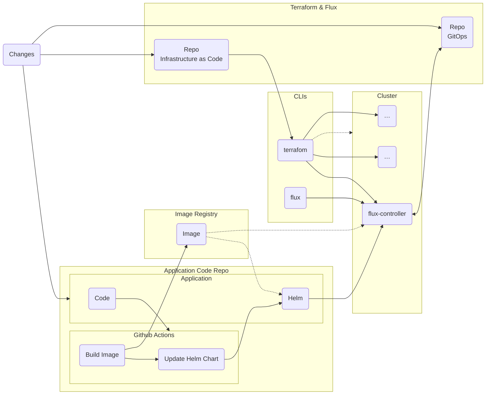

# Terraform + Flux

Репо містить приклад розгортання кластера для роботи kubot (<https://github.com/Andygol/kubot.git>)

## Гілки

Гілка `main` містить код для розгортання кластера у GCP.

Для розгортання кластера локально з використанням kind, скористайтесь гілкою `kind` (<https://github.com/Andygol/tf-flux/tree/kind>)

Для явного вказання версії Kubernetes в Kind дивіться <https://github.com/den-vasyliev/tf-kind-cluster/pull/1> для внесення змін в модуль kind-cluster.

## Порядок розгортання

* Створіть файл `terraform.tfvars`, вкажіть ваші значення для змінних

  ```tf
  GITHUB_OWNER   = "…"
  GITHUB_TOKEN   = "…"
  GOOGLE_REGION  = "us-central1-c"
  GOOGLE_PROJECT = "ваш проєкт"
  GKE_NUM_NODES  = 2
  ```

* `tf init` – ініціалізація, завантаження модулів
* `tf validate` – перевірка конфігурації
* `tf apply` – застосування конфігурації, розгортання кластера

На цьому етапі кластер буде розгорнуто, але для подальшої роботи потрібно виконати перемикання на контекст кластера для отримання доступу до `kubeconfig`

```sh
gcloud container clusters get-credentials main --zone us-central1-c --project <ваш проєкт>
```

* `tf apply` – продовження розгортання з використанням отриманих налаштувань з kubeconfig
* `flux get all` – перевірка наявності nodes
* `k cluster-info` – відомості про кластер
* `flux check --pre` – перевірка передумов для flux
* `k get ns` – перевірка наявності потрібних namespace
* `flux logs -f` – безперервний вивід логів

* додамо в репо `flux-gitops` маніфест namespace для розгортання застосунку `flux-gitops/clusters/kubot/ns.yaml`; спостерігаємо за логами, щоб переконатись що маніфест було використано для створення namespace

    ```yaml ns.yaml
    apiVersion: v1
    kind: Namespace
    metadata:
      name: kubot
    ```

* `k get ns` – перевіряємо namespace
  
* `flux create source git kubot --url=https://github.com/Andygol/kubot.git --branch=main --namespace=kubot --export` – згенеруємо маніфест GitRepository `flux-gitops/clusters/kubot/kubot-gr.yaml`
  
  ```yaml
  apiVersion: source.toolkit.fluxcd.io/v1
  kind: GitRepository
  metadata:
    name: kubot
    namespace: kubot
  spec:
    interval: 1m0s
    ref:
      branch: main
    url: https://github.com/Andygol/kubot.git
  ```

* `flux create helmrelease kubot --namespace kubot --source GitRepository/kubot --chart ./helm --interval 1m --export` – згенеруємо маніфест HelmRelease `flux-gitops/clusters/kubot/kubot-hr.yaml` 

  ```yaml
  apiVersion: helm.toolkit.fluxcd.io/v2beta2
  kind: HelmRelease
  metadata:
    name: kubot
    namespace: kubot
  spec:
    chart:
      spec:
        chart: ./helm
        reconcileStrategy: ChartVersion
        sourceRef:
          kind: GitRepository
          name: kubot
    interval: 1m0s
  ```

* додамо маніфести в репо `flux-gitops/clusters/kubot/kubot-gr.yaml`, `flux-gitops/clusters/kubot/kubot-hr.yaml`

* `flux logs -f` – перевіримо застосування маніфестів
* в разі помилки застосування `kubot-hr.yaml` перевіримо версію API `kubectl logs -n flux-system deployment/helm-controller | jq -r 'select(.source != null) | .source'`

* змінимо версію ~~`v2beta2`~~ --> `v2beta1` в маніфесті `kubot-hr.yaml` -->

* `k get po -n kubot` – перевірка створення поду 🫛
* `k describe pods -n kubot` – інформація про под 🫛
* … 🫛 под не запускається через відсутність токена для застосунку
* `tf destroy` – розбираємо збірку, припиняємо роботу кластера
* … далі буде

## Що відбувається під капотом

Terraform використовуючи опис ресурсів розгортає кластер, а Flux (знаходиться в залежностях ресурсів Terraform) ініціалізує репозиторій для GitOps.

Flux відстежує зміни в репозиторії GitOps та зміни в чарті Helm в репо нашого застосунку та застосовує їх.

Під час внесення змін в код застосунку за допомогою GitHub Actions в репо застосунку збирається новий образ контейнера та оновлюється версія чарту Helm.

За наявності таких змін Flux доставляє нову версію застосунку в кластер.


```mermaid

flowchart LR

subgraph ar["Application Code Repo"]
    subgraph ga["Github Actions"]
        update_helm("Update Helm Chart")
        build_img("Build Image")
    end
    subgraph app["Application"]
        code("Code")
        hc("Helm")
    end
end

subgraph reg["Image Registry"]
    img("Image")
end

subgraph CLIs
    tf("terrafom") 
    flux("flux")
    %% gcloud("gcloud")
    %% gsutils("gsutils")
end

subgraph tffx["Terraform & Flux"]
    direction LR
    go("Repo
    GitOps")
    iac("Repo
    Infrastructure as Code")
end

subgraph cluster[Cluster]
    other1("…")
    other2("…")
    fx("flux-controller")
end


pr("Changes") --> app & iac & go
code --> ga
iac --> tf --> fx & other1 & other2 
flux --> fx
img -.-> hc & fx 
update_helm --> hc
build_img --> update_helm 
build_img --> img 
hc -->fx 
fx <--> go

tf -.-> cluster
```

В разі внесення змін в опис ресурсів контейнера за допомогою Infracost (через GitHub Actions цього репо) виконується розрахунок можливих змін витрат на інфраструктуру. Якщо ці зміни відповідають нашим вимогам – виконуємо їх злиття в основну гілку та застосовуємо їх для оновлення інфраструктури.[^1]

[^1]: Для подальшої автоматизації можливо додати відповідні GitHub Actions, які будуть автоматично перевіряти та застосовувати зміні в цьому репо до розгорнутої інфраструктури, див <https://developer.hashicorp.com/terraform/tutorials/automation/github-actions>.
